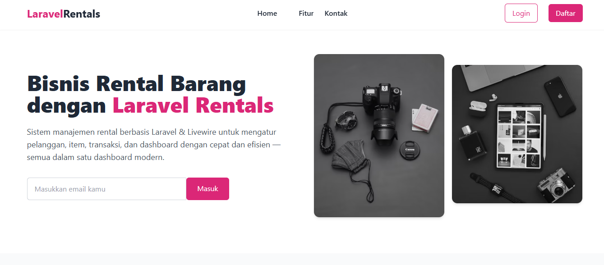
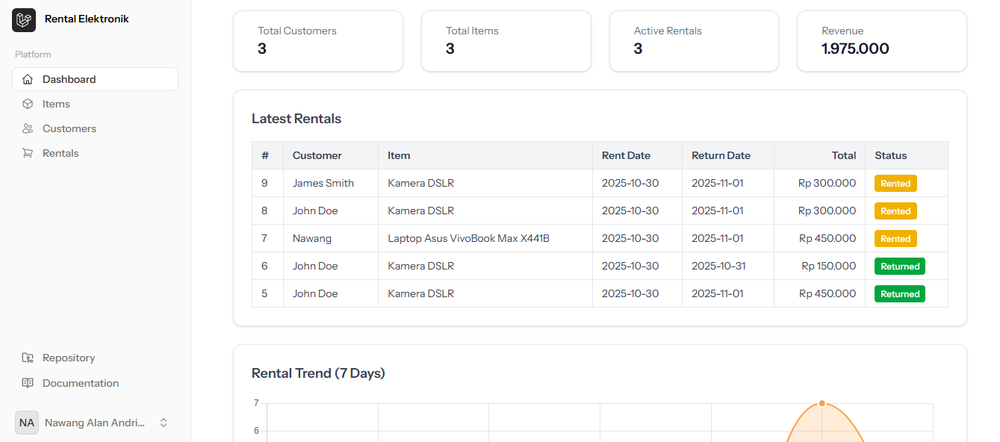
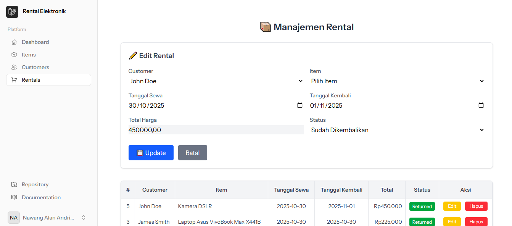

<p align="center">
  <a href="https://laravel.com" target="_blank">
    
  </a>
</p>

<p align="center">
  <a href="https://github.com/laravel/framework/actions"></a>
  <a href="https://packagist.org/packages/laravel/framework"></a>
  <a href="https://packagist.org/packages/laravel/framework"></a>
  <a href="https://packagist.org/packages/laravel/framework"></a>
</p>

# Rental Management System

Aplikasi ini dibuat menggunakan **Laravel 12** dan **Livewire** untuk memudahkan pengelolaan bisnis rental.  
Fitur utama dari aplikasi ini meliputi:

-   **Dashboard:** Menampilkan total pelanggan, total item, rental aktif, dan pendapatan.
-   **Rental Terbaru:** Melihat transaksi rental terbaru beserta statusnya (Rented / Returned).
-   **Grafik Tren Rental:** Menampilkan grafik tren rental 7 hari terakhir menggunakan Chart.js.
-   **Manajemen Pelanggan:** Menambahkan, mengubah, atau menghapus data pelanggan.
-   **Manajemen Item:** Mengelola data item yang dapat disewa.
-   **Manajemen Rental:** Mengelola data item yang disewa oleh pelanggan.

## Screenshot Aplikasi

Berikut contoh tampilan aplikasi:

<p align="center">
  
</p>

<p align="center">
  
</p>

<p align="center">
  
</p>

## Teknologi yang Digunakan

-   **Backend:** Laravel 12 (PHP Framework)
-   **Frontend:** Blade Template, Tailwind CSS, Livewire
-   **Database:** PostgreSQL
-   **Charting:** Chart.js
-   **Version Control:** Git dan GitHub

## Cara Menjalankan Aplikasi (Localhost)

1. Clone repository:

```bash
git clone https://github.com/nawangandrian/rental-livewire.git
```
